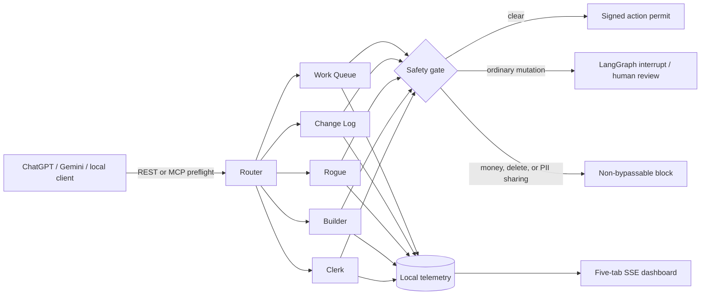

# Sentri

Sentri is a local-first governance control room for agent actions initiated from ChatGPT, Gemini, or another host. It runs proposed actions through a LangGraph preflight, captures five parallel telemetry views, pauses risky execution for review, and issues an authorization decision that the host must enforce.

> Sentri never executes arbitrary downstream tools. It signs short-lived permits bound to the complete canonical action. External tools use `/permits/verify` and `/outcomes`; optional allowlisted OpenAI/Gemini text generation can run through Sentri's controlled `/execute` gateway so usage is observed directly.

## Architecture



The five workers fan out concurrently after routing and join before the safety gate. Every event carries a shared audit envelope with execution/thread correlation, host, a hashed conversation identifier, schema and policy versions, evidence provenance, HMAC-chain expectations, and the three hard-limit controls. Their responsibilities are:

- **Work Queue:** call trees, action hashes, rationale, capabilities, retries, provider request IDs, and authorized-versus-reported action coverage.
- **Change Log:** proposed and observed changes, target and before/after hashes, rollback status, and explicit evidence gaps.
- **Rogue:** per-action policy decisions, control coverage, permit validation, final-response PII scan status, and hard-limit bypass detection; this is the circuit breaker.
- **Builder:** planned and completed DAGs with timings, result hashes, source lineage, calculation steps, runtime diagnostics, and cross-links to all terminal events.
- **Clerk:** preflight and downstream latency, missing measurements, retries, cache/timeout details, tokens, cost, success counts, and p95 timing.

After an authorized outcome is reported, Sentri writes one correlated terminal event to **each** worker tab. The dashboards add rolling execution count, completion rate, and observed action p95 alongside alerts, tokens, and cost. This supports incident reconstruction, capability adoption analysis, performance tuning, and an integrity-verifiable audit without retaining raw prompts or tool outputs.

## Hard safety contract

These policies are enforced against a normalized tool name, operation, and arguments before authorization:

- Financial transactions and payment API calls are blocked.
- File, database, asset, and record deletion calls are blocked.
- Transmission of detected unhashed email addresses, phone numbers, SSNs, card-like values, IP addresses, dates of birth, or postal addresses is blocked.

A hard-limit finding invokes LangGraph's native `interrupt`, produces a Rogue alert, and asks a reviewer to acknowledge or revise the request. It is deliberately **not overridable**: even an approval resolves to `blocked`. Ordinary state-changing actions also interrupt, but may resume after approval. Telemetry is recursively redacted before it reaches RAM, SQLite, JSONL, or the dashboard stream.

Each authorization contains a five-minute HMAC permit bound to the execution, thread, action ID, canonical action hash, nonce, and expiration. `/permits/verify` consumes the permit once and records the receipt before the host executes the downstream action. After execution, the host reports every outcome with its permit. Optional structured `diagnostics` include provider/model/tool versions, provider request ID, attempts/retries, timeout and HTTP status, cache status, bounded calculation/state-transition steps, token/cost usage, and source evidence. Source query strings and fragments are removed before storage while a full-URI hash preserves correlation. The Builder extends the DAG with `tool_result` nodes and an optional `final_response` node. Raw outputs are not persisted; Sentri stores hashes, status, timing, redacted metadata, and result edges. Detected PII in a reported final response is rejected, and common secret-bearing metadata fields are replaced with `[REDACTED_SECRET]`.

Permit signatures prove that Sentri authorized an exact action. External downstream status and diagnostics remain caller-reported. For supported model calls, `/execute` consumes the exact-action permit, calls a fixed provider origin with a server-side key, reads provider-reported usage, calculates configured cost, and records a `sentri_gateway_observed` attestation. Provider output is returned to the authorized caller but only its hash is persisted.

### Controlled model gateway

Set `SENTRI_GATEWAY_ENABLED=true`, configure at least one server-side provider key, and explicitly allow its models. Never place a provider key in a chat message or action arguments.

The accepted actions are deliberately narrow:

- OpenAI: `tool="openai.responses"`, `operation="create"`, with `model`, `input`, and optional generation parameters.
- Gemini: `tool="gemini.generate_content"`, `operation="generate"`, with `model`, `contents`, and optional generation parameters.

First send the exact action to `/interact`. If authorized, call `/execute` with the returned `execution_id`, `thread_id`, exact action, and corresponding permit. The gateway validates the complete action set before consuming anything, consumes each permit immediately before its provider call, aborts remaining calls on failure, and writes correlated terminal evidence for all five agents. The Clerk uses OpenAI `usage.input_tokens/output_tokens/total_tokens` or Gemini `usageMetadata.promptTokenCount/candidatesTokenCount/totalTokenCount`; cost remains zero until matching per-million rates are configured in `SENTRI_GATEWAY_PRICING`.

When a host performs research before the gateway call, it can include an `upstream_tools` list in `/execute` or `sentri_execute`. Each reference contains only `tool`, `operation`, status, an optional provider request ID, and optional evidence IDs. Work Queue labels this lineage `caller_reported`, while the direct provider action is labeled `sentri_gateway_observed`. Raw upstream arguments and outputs are rejected by the structured schema and are not persisted. Terminal Work Queue actions repeat the tool, operation, provider, model, request ID, and attestation; Builder links upstream-tool nodes into the completed DAG.

Stored telemetry carries a sequence number, previous-event hash, and keyed HMAC integrity value. Use `GET /audit/verify` locally to validate the active store. This detects modification; it does not replace external backups or an independently operated audit sink.

Retention deletion is an internal maintenance operation on Sentri's own expired telemetry, not an agent-callable tool, and is the only deletion path in the service.

## Run locally

Requires Python 3.11 or newer.

```powershell
python -m pip install -e ".[dev]"
Copy-Item .env.example .env
python -m sentri.main
```

The local fallback dashboard is at `http://localhost:8000/dashboard`. When connected through a compatible MCP Apps host, ask it to **open the Sentri Control Room** and the same controls render inside the conversation. API documentation is at `http://localhost:8000/docs`, and Streamable HTTP MCP is mounted at `http://localhost:8000/mcp/`.

Example safe preflight:

```powershell
$body = @{
  message = "Read project alpha"
  host = "local"
  actions = @(@{
    tool = "project.get"
    operation = "read"
    arguments = @{ project_id = "alpha" }
    mutates_state = $false
  })
} | ConvertTo-Json -Depth 5
Invoke-RestMethod http://localhost:8000/interact -Method Post -ContentType application/json -Body $body
```

The successful response contains `result.permits`. Before executing an action, submit its exact original action object and permit to `POST /permits/verify`. A consumed permit cannot be replayed.

## Storage and retention

Select the active storage type and retention period from the **Storage and retention** panel in the local dashboard. Changes apply immediately and are persisted to `~/Documents/Sentri/settings.json`. Switching modes does not migrate or delete data from the previous backend.

The initial values can also be set in `.env`:

| Setting | Values | Default |
|---|---|---|
| `SENTRI_STORAGE_MODE` | `ephemeral`, `sqlite`, `jsonl` | `sqlite` |
| `SENTRI_DATA_DIR` | local directory | `~/Documents/Sentri` |
| `SENTRI_RETENTION_DAYS` | positive integer or `Forever` | `30` |
| `SENTRI_API_TOKEN` | random value of at least 32 characters | required for non-loopback URLs |
| `SENTRI_SIGNING_SECRET` | independent random value of at least 32 characters | required for non-loopback URLs |
| `SENTRI_PERMIT_TTL_SECONDS` | positive integer | `300` |
| `SENTRI_GATEWAY_ENABLED` | `true` or `false` | `false` |
| `SENTRI_OPENAI_API_KEY` / `SENTRI_GEMINI_API_KEY` | server-side secrets | unset |
| `SENTRI_GATEWAY_ALLOWED_OPENAI_MODELS` | JSON list of exact model names | `[]` |
| `SENTRI_GATEWAY_ALLOWED_GEMINI_MODELS` | JSON list of exact model names | `[]` |
| `SENTRI_GATEWAY_PRICING` | JSON object of operator-maintained rates | `{}` |

SQLite uses `~/Documents/Sentri/sentri.db` with execution/worker/time indexes. JSONL uses `~/Documents/Sentri/logs/YYYY-MM-DD_sentri.jsonl`. Expiration runs at startup and every 24 hours. Ephemeral data exists only in process memory.

When no signing secret is supplied in loopback development, Sentri creates `~/Documents/Sentri/.sentri-signing.key` with restrictive permissions so audit verification survives restarts. Do not commit, synchronize, or share this key. Public deployments must supply `SENTRI_SIGNING_SECRET` through a secret manager.

## Host integration

### ChatGPT

For a classic GPT Action, replace `YOUR_PUBLIC_SENTRI_HOST` in [`openapi.json`](openapi.json) with a reachable HTTPS origin and import it as the Action schema. Configure Bearer authentication using `SENTRI_API_TOKEN`. A hosted ChatGPT session cannot call `localhost`; use a controlled HTTPS tunnel or deploy behind TLS. Sentri refuses to start with a non-loopback public URL unless both authentication and signing secrets are configured.

For a current ChatGPT plugin/App integration, connect the Streamable HTTP MCP endpoint. In addition to the governance tools, `sentri_render_control_room` returns a portable `ui://` resource using the MCP Apps MIME type. ChatGPT can therefore render the control room inside the conversation; `sentri_dashboard_data` refreshes it without remounting, and `sentri_configure_storage` applies settings from the embedded UI. The standalone local dashboard remains available as a fallback. See the [official OpenAI MCP UI guide](https://developers.openai.com/plugins/build/chatgpt-ui).

### Gemini

Gemini function declarations use OpenAPI-style schemas, so the request objects in `openapi.json` can be mapped to function tools. Current Gemini CLI Extensions can bundle an MCP server, making Sentri's `/mcp/` endpoint the most direct integration path. The `ui://` resource is portable to Gemini or other clients when that specific host implements MCP Apps UI; tool-only MCP clients continue to receive the structured snapshot without rendering the component. The host must preserve the same preflight contract and must not run downstream actions while Sentri returns `approval_required` or `blocked`. Google documents both [OpenAPI-style function declarations](https://ai.google.dev/api/generate-content#FunctionDeclaration) and [MCP-backed Gemini CLI extensions](https://codelabs.developers.google.com/getting-started-gemini-cli-extensions).

## API

- `POST /interact` — route and preflight a host request.
- `POST /approvals/{thread_id}` — resume an interrupted execution.
- `POST /outcomes` — attach observed downstream results to the authorized Builder DAG.
- `POST /execute` — execute authorized allowlisted model calls and capture provider usage.
- `POST /permits/verify` — validate and consume a signed exact-action permit.
- `GET /audit?execution_id=...` — query stored telemetry.
- `GET /health` — service, retention, and hard-limit status.
- `GET /dashboard-stream` — server-sent telemetry events.
- `GET /dashboard` — local five-tab control room.
- `/mcp/` — Streamable HTTP MCP transport.

## Production notes

Loopback mode remains authentication-free for local development. Non-loopback mode automatically requires a Bearer service token and signing secret, restricts configured CORS origins, applies request-size and per-client rate limits, and protects REST plus MCP through the same middleware. For multi-user production, place Sentri behind OAuth/OIDC so individual reviewer identities and roles replace the shared service principal. Terminate TLS at a trusted reverse proxy and replace the in-memory LangGraph checkpointer so interrupted approvals survive restarts.

Run validation with:

```powershell
python -m pytest -q --basetemp .sentri-test-tmp -p no:cacheprovider
python scripts/export_openapi.py
python scripts/check_public_repo.py
```

## Publishing this repository

The repository ignores local environments, test artifacts, `.env` files,
signing keys, databases, runtime settings, and JSONL telemetry. Keep the
`YOUR_PUBLIC_SENTRI_HOST` placeholder in the published OpenAPI document and
inject real deployment URLs outside source control. Before the first push and
each release, run `python scripts/check_public_repo.py`, review
`git status --short --ignored`, and enable the Git host's secret scanning, push
protection, and private vulnerability reporting. See [`SECURITY.md`](SECURITY.md)
for reporting and deployment guidance. Sentri is distributed under the MIT
License.
