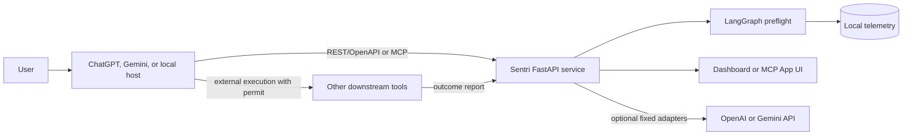
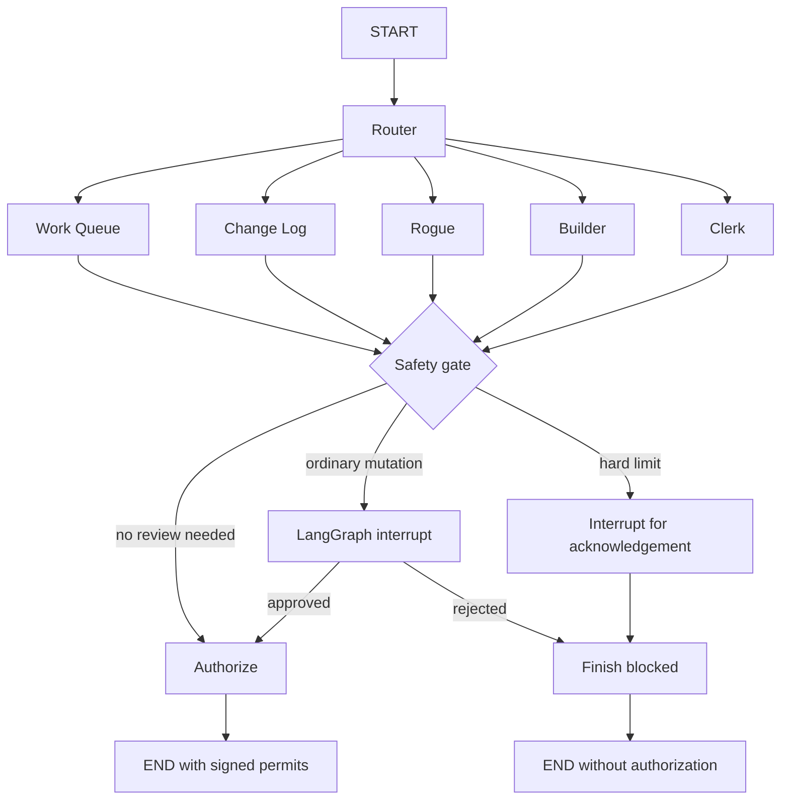

# Architecture

## System context

The host owns the conversation and decides when to invoke Sentri. Sentri owns policy evaluation, authorization, permits, selected model-provider execution, telemetry, and incident reconstruction.

## LangGraph lifecycle

The five worker nodes fan out after routing and join at the safety gate. They are telemetry hooks, not five independent tool executors. This design gives each worker the same immutable proposed-action context while letting each produce a specialized audit view.

## Worker responsibilities

| Worker | Preflight event | Terminal event | Investigation value |
|---|---|---|---|
| Work Queue | `call_tree` | `execution_completed` | Caller/callee tree, exact action hash, rationale, tool lineage, attempts, and provider request IDs. |
| Change Log | `proposed_changes` | `change_outcome` | Proposed versus observed changes, before/after hashes, rollback state, and evidence gaps. |
| Rogue | `policy_evaluation` | `post_execution_safety` | Hard-limit decisions, control coverage, permit validation, response PII scan, and bypass indicators. |
| Builder | `planned_execution` | `execution_outcome` | Planned and completed DAGs, result hashes, source lineage, calculations, and final response hash. |
| Clerk | `cost_metrics` | `performance_outcome` | Latency, retries, timeout/cache information, provider tokens, cost, success counts, and p95 timing. |

Every event includes a shared audit envelope for execution and thread correlation, origin, policy/schema versions, related events, and evidence boundaries.

## State model

`SentriState` is a LangGraph `TypedDict` carrying:

- `execution_id` and `thread_id`
- normalized host request and planned actions
- graph messages and current status
- worker telemetry events
- risk alerts and approval decision
- change set and execution DAG
- cost metrics and final authorization result

Each interaction receives a unique graph thread. A supplied conversation ID is hashed for correlation rather than stored raw. The current checkpointer is LangGraph `MemorySaver`; interrupted graph state does not survive a backend restart. Persistent production handoff therefore requires replacing the in-memory checkpointer.

## Safety model

Rogue normalizes tool names, operations, arguments, and classifications before policy evaluation. Three controls are hard limits:

- `HARD_NO_MONEY`: blocks financial transactions and payment calls.
- `HARD_NO_DELETE`: blocks agent-requested file, database, asset, or record deletion.
- `HARD_NO_PII_SHARING`: blocks transmission of detected unhashed personal information.

Retention purging is an internal maintenance path over Sentri's own expired telemetry. It is not exposed as an agent-callable delete tool.

Hard-limit findings invoke a LangGraph interrupt so the incident is visible and acknowledged. The interrupt payload marks the action as non-approvable; resuming it can only produce `blocked`.

## Permit lifecycle

1. `/interact` evaluates the complete `PlannedAction`.
2. An authorized response issues a short-lived HMAC permit.
3. The permit binds execution ID, thread ID, action ID, canonical action hash, nonce, and expiration.
4. Immediately before execution, the host calls `/permits/verify` with the exact action and consumes the permit.
5. Replay, expiration, signature mismatch, action mismatch, or unknown graph state fails closed.
6. The host reports terminal results through `/outcomes`, or Sentri performs steps 4–6 through `/execute`.

A permit proves Sentri authorized an exact action. It does not prove an external tool reported truthful results. The Builder and Work Queue label those results `caller_reported`. Provider calls made by the controlled gateway are labeled `sentri_gateway_observed`.

## Controlled execution gateway

The gateway accepts only fixed, non-mutating text-generation adapters:

- `openai.responses` with operation `create`
- `gemini.generate_content` with operation `generate`

Provider credentials remain server-side. Models require explicit allowlisting. The gateway validates the complete batch before consuming permits, calls fixed provider origins, bounds output size and request time, reads provider-reported usage, and persists only output hashes and redacted diagnostics. Output containing detected personal information or secret-like material is suppressed.

## Storage and integrity

`SentriStorageEngine` applies recursive redaction before writing any event. Events receive a monotonic sequence, previous-event hash, and keyed HMAC integrity value. This creates a tamper-evident local chain across the active backend.

Integrity verification detects modification or broken linkage. It is not an immutable external ledger: an attacker with the signing secret and write access could replace data and signatures. Production deployments should protect the key and export or replicate audit evidence to an independently controlled system when stronger assurance is required.

## Data intentionally not persisted

- Provider API keys and Sentri service secrets
- Raw provider output
- Raw final host response
- Raw upstream tool arguments or output
- Query strings and fragments from evidence URIs
- Detected secret-bearing metadata values

Hashes preserve correlation where possible without retaining the original content.
